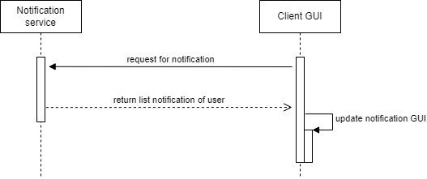

# notification-system
a nodejs server for push notification using SSE(server sent event)

1. Database

   

2. Biểu đồ tuần tự

   a. Biểu đồ tuần tự tạo thông báo mới

   

b.  Biểu đồ tuần tự get notification

